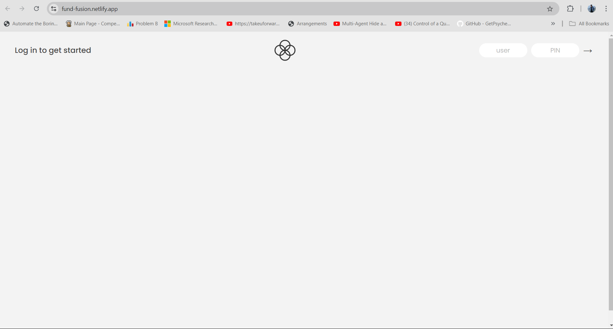

# FundFusion

# Screenshots
Login Page

Home Page

# Demo
Link to the live demo -> https://fund-fusion.netlify.app/

# Description
Fundfusion is a feature-rich banking application that allows users to manage their finances efficiently. With FinFlow, users can transfer money to other users, request loans, deposit and withdraw funds, and track their transactions seamlessly. This project showcases advanced JavaScript capabilities along with HTML and CSS for creating a dynamic and interactive web application.

# Features
- User Registration and Authentication
- Transfer Money between Users
- Request Loans
- Deposit and Withdraw Funds
- Transaction History
- User-friendly Interface

# Technologies Used
HTML
CSS
JavaScript

